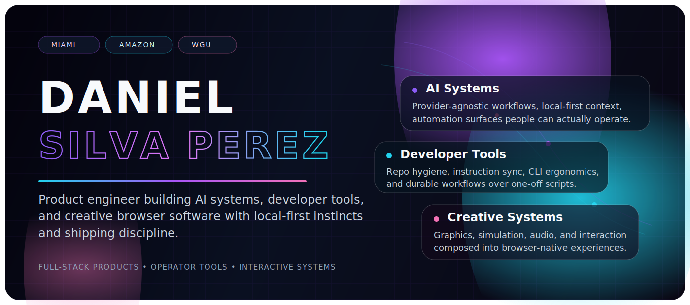
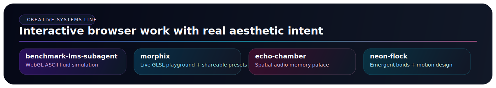

  

  

  
  
  
  
  

  

  <b>Miami-based product engineer</b> building recruiter-friendly software with strong visuals, sharp tooling, and local-first instincts.

---

<table>
<tr>
<td width="56%" valign="top">

## ✦ Open First

If you want the fastest read on how I think and build, start here:

- **[glide-type-ios](https://github.com/daniel-silva-perez/glide-type-ios)** — privacy-first iOS keyboard with offline glide typing, candidate correction, custom keyboard extension, and an explicit trust boundary.
- **[markdown-agent](https://github.com/daniel-silva-perez/markdown-agent)** — Python CLI that keeps `AGENTS.md`, `CLAUDE.md`, and `GEMINI.md` aligned with meaningful codebase changes.
- **[ocaml-trading-engine](https://github.com/daniel-silva-perez/ocaml-trading-engine)** — typed, event-driven trading systems lab for replay, risk checks, and correctness-heavy domain modeling.
- **[creative-systems](https://github.com/daniel-silva-perez/creative-systems)** — live gallery + monorepo that consolidates my browser-native experiments in simulation, audio, shaders, and interactive worlds at [daniel-silva-perez.github.io/creative-systems](https://daniel-silva-perez.github.io/creative-systems/).

## ✦ What I Build

- **Full-stack product software** with TypeScript, Next.js, React, Supabase, and Vercel
- **AI systems + agent tooling** for provider-agnostic workflows, local-first context, and operator-friendly automation
- **Developer infrastructure** that keeps repos, docs, and repeated workflows maintainable
- **Creative systems** where rendering, simulation, audio, interaction, and polish all matter at once
- **Privacy-conscious browser + mobile tools** that avoid unnecessary backends and preserve user control

## ✦ Current Trajectory

Currently: General Manager Assistant at **Amazon**, blending executive operations with technical automation. Studying **Software Engineering** at WGU while shipping projects in public.

</td>
<td width="44%" valign="top">

  

  

</td>
</tr>
</table>

  

## Portfolio Lines

### Product + AI Systems
- **[kanban-hermes](https://github.com/daniel-silva-perez/kanban-hermes)** — deployed Next.js kanban product focused on fast capture, prioritization, and readable project flow.

### Developer Infrastructure
- **[ai-chat-sync](https://github.com/daniel-silva-perez/ai-chat-sync)** — local-first userscript that syncs AI chats across ChatGPT, Claude, and Gemini without a backend.
- **[ai-chat-export-tool](https://github.com/daniel-silva-perez/ai-chat-export-tool)** — browser export tool for turning AI conversations into clean Markdown or JSON artifacts.

### Creative Systems
- **[benchmark-lms-subagent](https://github.com/daniel-silva-perez/benchmark-lms-subagent)** — interactive WebGL ASCII fluid simulation built as a high-signal frontend benchmark.
- **[morphix](https://github.com/daniel-silva-perez/morphix)** — live GLSL playground with real-time editing, presets, compile feedback, and shareable URLs.
- **[echo-chamber](https://github.com/daniel-silva-perez/echo-chamber)** — spatial audio memory palace combining 3D navigation, voice capture, and directional playback.
- **[neon-flock](https://github.com/daniel-silva-perez/neon-flock)** — murmuration simulator focused on emergent flocking behavior, spatial partitioning, and motion design.

<b>Stack / tools / technologies</b>

 

**Languages:** TypeScript, Python, Swift, Rust, Go, OCaml, SQL  
**Frontend:** Next.js, React, Tailwind CSS, WebGL, Three.js, p5.js, Canvas  
**Backend:** Node.js, Bun, Supabase, PostgreSQL, Redis, SQLite  
**AI / ML:** OpenAI API, Claude API, Gemini API, Ollama, llama.cpp, LangChain  
**Infra / tooling:** GitHub Actions, Vercel, Docker, Linux, GitHub CLI, pnpm, Vitest, Playwright, pytest, Swift Package Manager

## Build Principles

> I like software that is inspectable, local-first when possible, visually intentional, and clear enough for a recruiter or user to grasp the value in under a minute.

## Contact

- **Website:** [danielsilvaperez.com](https://danielsilvaperez.com/)
- **LinkedIn:** [linkedin.com/in/danielsilvaperez](https://www.linkedin.com/in/danielsilvaperez/)
- **Search portfolio:** [daniel-search.vercel.app](https://daniel-search.vercel.app)
- **GitLab mirror:** [gitlab.com/danielsilvaperez](https://gitlab.com/danielsilvaperez)
- **Email:** `danielsp.dev@gmail.com`
